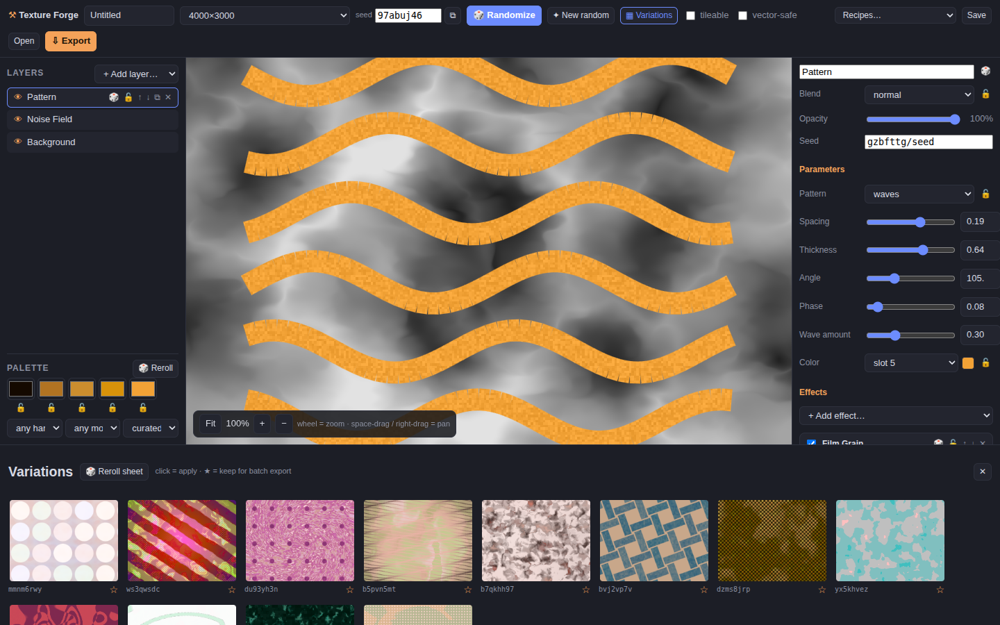

# Texture Forge

A browser-based procedural generator for high-quality backgrounds, textures, and
digital assets — built for producing stock-ready artwork with **zero generative AI**.
Everything is created from randomized shapes, gradients, color palettes, decorative
typography, and GPU image filters, driven by a deterministic seed system so every
result is reproducible and fully adjustable.



## Run it

```bash
npm install
npm run dev        # development server
npm run build      # production build → dist/
npm test           # unit tests (Vitest)
npm run typecheck  # strict TypeScript check
```

Requires a browser with WebGL2 (all modern browsers).

## Desktop app (Windows .exe)

The app can be packaged as a standalone desktop app via Electron:

```bash
npm run package:win
```

This produces `release/Texture Forge-win32-x64/` — a portable folder containing
`Texture Forge.exe` (no installer, no admin rights needed; zip it to share).
Exports and saved projects land in the user's Downloads folder via an IPC save
bridge (`electron/preload.cjs` → `tf-save-file`), since blob-anchor downloads
don't reach disk reliably from `file://` in Electron. Other platforms work the
same way, e.g. `--platform=linux` or `--platform=darwin` with `@electron/packager`.

## Features

### Generation & editing
- **Layer stack** — Fill/Gradient (linear, radial, conic, freeform blobs), Shape
  Scatter (7 primitives × 5 placement strategies incl. flow-field and recursive
  subdivision), Noise Field (fbm/billow/ridged/worley with domain warp), Pattern
  (stripes, checker, dots, herringbone, waves, rings), and decorative Type
  (single/scatter/grid/ring/wave layouts, local font loading)
- **28 GPU filters** in four packs, all non-destructive layer effects:
  - *Core:* gaussian/radial/motion blur, posterize, pixelate, polar coordinates,
    invert, levels, hue/saturation
  - *Distortion:* noise displace, wave warp, twirl, ripple, lens, kaleidoscope,
    flow smear
  - *Stylize:* halftone, ordered dither, scanlines, chromatic aberration,
    glow/bloom, duotone, threshold, edge detect
  - *Texture:* film grain, paper fiber, canvas weave, marble, voronoi cells,
    wood rings, brushed metal, vignette
- **12 blend modes** per layer, GPU-composited

### Randomization (the heart of the tool)
- Global **Randomize** (Space), per-layer and per-effect dice
- **Locks at every level**: layers, individual parameters, blend/opacity, palette
  swatches, effects — randomize only ever touches what's unlocked
- **Deterministic seeds**: same seed + same settings = same pixels; the seed is
  always visible, editable, and copyable
- **Variations contact sheet** (V): 12 seeded variants at a glance — click to
  apply, star to queue for batch export
- **Harmony color engine**: palettes generated in OKLCH from color-theory rules
  (monochrome/analogous/complementary/split/triadic) × mood transforms
  (dark moody, pastel, neon, earth), plus 20 curated palettes; layers reference
  palette *slots*, so a palette swap recolors the whole composition
- Full undo/redo covering every change, including randomize rolls

### Stock-focused output
- **High-res export**: PNG/JPEG up to a 12000px edge, rendered in a Web Worker
  and **tiled** (2048px tiles + 256px apron) so huge exports neither hit GPU
  texture limits nor freeze the UI — verified to 12000×9000 (108MP)
- **Batch export** of starred variations with `{name}-{seed}-{w}x{h}.{ext}`
  filenames + optional CSV manifest for stock bulk-upload sheets
- **Seamless-tile mode**: periodic noise and toroidal shape wrapping, with a 3×3
  live tiling preview
- **Vector-safe mode**: restricts the document to SVG-representable
  layers/effects and exports clean SVG (Shutterstock needs EPS — convert via
  Inkscape/Illustrator)
- Document presets at stock-ready sizes (4MP minimum flagged in the export dialog)

### Projects
- Save/open `.json` project files (versioned schema with migration hook)
- Autosave to IndexedDB; session restores on reload
- **Style recipes**: save a layer stack as a reusable template and reroll
  infinite on-brand variants
- No backend, no accounts, no telemetry — everything stays local

## Keyboard shortcuts

| Key | Action |
| --- | --- |
| `Space` | Randomize everything unlocked |
| `V` | Variations contact sheet |
| `Cmd/Ctrl+Z` / `+Shift+Z` | Undo / redo |
| `Cmd/Ctrl+S` | Save project file |
| `Cmd/Ctrl+E` | Export dialog |
| `1–9` | Select layer |
| wheel / space-drag | Zoom / pan canvas |

## Architecture

```
src/engine/          rendering core — no React imports, reusable headlessly
  types.ts           versioned document model + declarative param schemas
  prng.ts            xmur3/mulberry32 seeded PRNG; every roll is seed-derived
  palette.ts         OKLCH harmony engine + curated palettes
  randomize.ts       lock-aware rerolling, starter documents
  displaylist.ts     shape/type placement shared by raster AND svg output
  canvas2d.ts        2D rasterizer (worker-safe, tileable-aware)
  gl/compositor.ts   WebGL2 pipeline: generators, effect passes, blending
  gl/filters.ts      declarative filter registry — one entry per filter
  svg.ts             vector-safe SVG export
  export/            tiled worker export
src/state/           zustand store, undo/redo, IndexedDB persistence
src/ui/              React panels (top bar, layers, canvas, inspector, variations)
```

Determinism contract: `render(document)` is a pure function of the document
JSON. Randomize writes new seeds/params into the document; rendering derives
all procedural placement from those seeds. (Minor pixel differences across
GPUs are acceptable; a given machine always reproduces its own output.)

## Testing

- `npm test` — 16 unit tests: PRNG/noise determinism, palette gamut mapping and
  lock behavior, document randomization determinism + lock guarantees, schema
  migration, display-list determinism, SVG snapshot sanity
- `scripts/smoke.mjs` / `scripts/smoke-export.mjs` — headless-Chromium smoke
  tests (render + randomize + variations; worker PNG export + SVG export).
  Run a preview server first: `npm run build && npx vite preview --port 4173`,
  then `node scripts/smoke.mjs` (set `CHROMIUM_PATH` if needed).

## Acceptance checklist

- [x] Starter document renders a designed composition on first launch
- [x] Randomize/locks/seeds behave deterministically (unit-tested)
- [x] All 28 filters compile and render (exercised via randomized variations)
- [x] Variations sheet renders 12 thumbnails and applies/stars correctly
- [x] 4000×3000 PNG export via worker (verified headless)
- [x] 12000×9000 tiled JPEG export via worker (verified headless)
- [x] Vector-safe SVG export produces well-formed, deterministic SVG
- [x] Project save/open, autosave restore, recipes
- [ ] Cross-browser pass (Firefox/Safari) — manual
- [ ] Performance pass on a mid-range laptop — manual

## Non-goals (v1)

No generative AI or ML of any kind, no backend/accounts, no photo import,
no EPS writer, no CMYK, no animation. Text exports as SVG `<text>` (not
outlined paths) — outline-to-path conversion is a v2 item.
